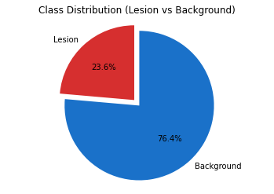
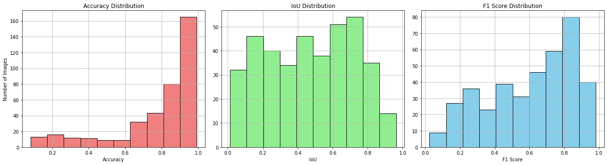
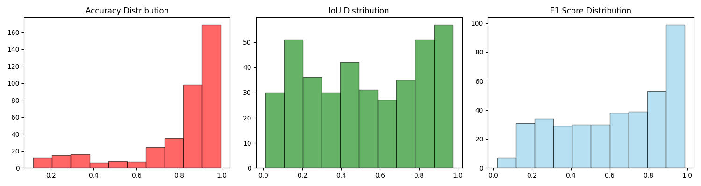
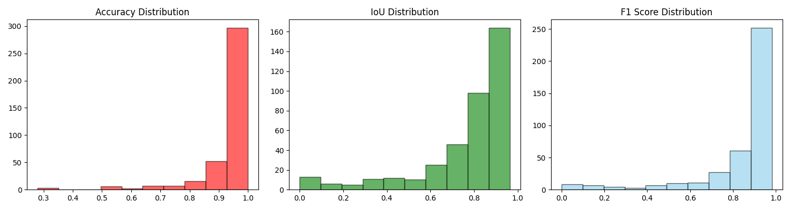
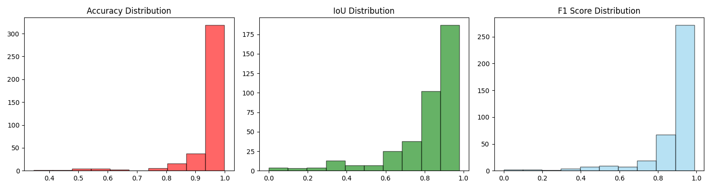

# ISIC 2018 Skin Lesion Segmentation
This project explores unsupervised and supervised image segmentation methods applied to the **ISIC 2018 skin lesion dataset**. It compares simple segmentation techniques like **KMeans** and **Gaussian Mixture Models (GMM)** against deep learning models (Unet, Inception-inspired CNN and SegFormer). The deep models are trained on ISIC data, evaluated on the test set and its performance is compared with the baseline models. 

## Goals
- Segment skin lesions from dermoscopic images.
- Compare baseline unsupervised methods (KMeans, GMM) with deep learning models (Unet, Inception-inspired CNN, SegFormer).
- Evaluate masks using standard metrics: **IoU**, **F1-score**, **Accuracy**.
- Visualize results with overlays (predictions vs. ground truth).
- Explore which morphological operations can improve the quality of the segmentations.
    (erosion, dilation, opening, closing)

## Dataset
- **ISIC 2018 Challenge - Task 1**
- ~2,600 dermoscopic images and ground truth lesion masks.
- Downloaded from [ISIC Archive](https://challenge.isic-archive.com/data/#2018).
The images and masks are stored in different folders.
- The dataset is split into training, validation, and test sets.
- Due to the nature of the task, there is a notable class imbalance, which we have to take into account when training and evaluating the models.

## Unsupervised Methods
- **KMeans**: Clustering algorithm that partitions the image into K clusters based on distances between pixel values.
- Results: 

- **Gaussian Mixture Models (GMM)**: Probabilistic model that assumes the presence of multiple Gaussian distributions in the data.
- Results: 

## Supervised Methods
- **Unet**: A convolutional neural network architecture designed for biomedical image segmentation.
- Results:

- **Inception CNN**: A custom architecture inspired by the Inception model, designed for image segmentation tasks. 
- Results:
<!--  -->
- **SegFormer**: A transformer-based model that captures long-range dependencies in images, achieving state-of-the-art results in various vision tasks.
- Results:

## Evaluation results
From the evaluation of the models on the test set, we can see that the deep learning models outperform the unsupervised methods in terms of IoU, F1-score, and accuracy. The SegFormer model achieves the best results, followed by Unet and Inception CNN. Overall, it is clear that the deep learning models are able to segment skin lesions better than the unsupervised methods. It is also worth noting that all models significantly outperform the majority baseline (which would achieve an accuracy of 76.4%).

## How to Run
1. **Setup**: Install dependencies with `pip install -r requirements.txt`.
2. **Training**: Run `python main.py --model segformer --epochs 20 --visualize True` to train the SegFormer (or any of the other models).
3. **Testing**: Use the `python main.py --model segformer --visualize True` to evaluate and visualize model predictions on the test set, with a `segformer.pt` file in the same directory.